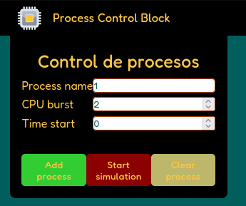
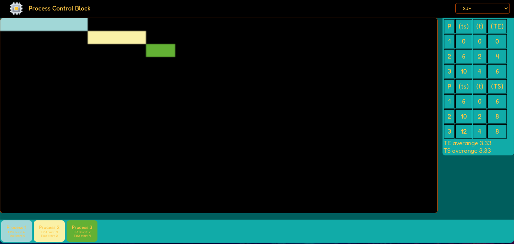
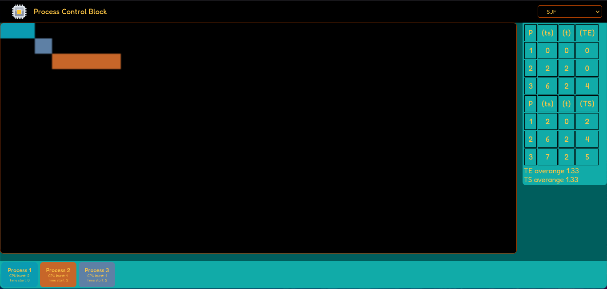
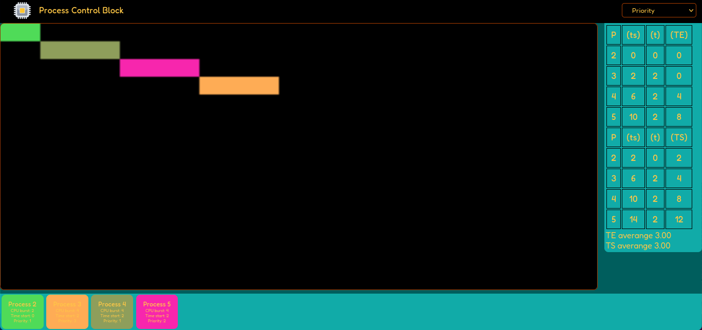
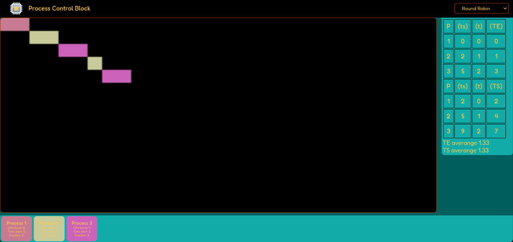

# Process-Control-Block

The process control block or PCB are algorithms used for OS to manage its task,
this simulator create dynamic graphic using a canvas.

## Form

This implementation works under a form, where you add every process

## Simulation

> Note: All the representation here don't take care about blanks, such as piece of a process
> it means that "blanks" will be ommited

### FIFO

This is an example of a FIFO simulation; this algorithm works as a line
where every process who is "in" will complete its task, then the next process
who follows its "entrance" will continue

### SJF

SJF represents shorter first; in this algorithm, the shortest avalible process
will follow the next one

### Priority

Using priority algorithm, task stack will be display all the process by sorting
every process by a new task call "priority" what means that every process will
have a priority

### Round Robin

RR or Round Robin is an algorithm who "cuts" the process to make CPU work a little
faster than previous algorithms, its main caractheristic is the cutting process this
process use "rounds", generally this is an static number that tells the CPU how many
time a task can use the CPU, but in this implementation it is dynamic

Still in process...

### To do

- [x] Performe FIFO simulation
- [x] Performe SJF simulation
- [x] Performe Priority simulation
- [x] Performe Round Robin simulation
- [ ] Scale boxes to fit canvas properly
- [x] Improve documentation
